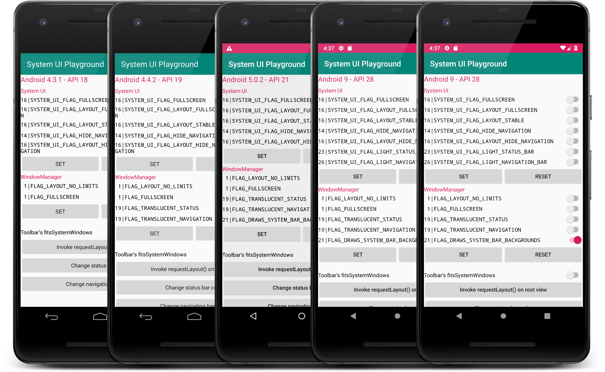

# System UI Playground

A tiny app lets you manipulate system UI like a piece of cake 🎂

## Screenshot

## Cheat Sheet

This table shows the limitation when we try to customize **Status Bar** and **Navigation Bar** in different versions.

API Level | Translucent background | Colorful background | Dark / Light mode
-- | -- | -- | --
18 and below | X | X | X
19 ~ 20 | O | X | X
21 ~ 22 | O | O | X
23 and above | O | O | O

## License

    Copyright 2019 Samuel Huang
    
    Licensed under the Apache License, Version 2.0 (the "License");
    you may not use this file except in compliance with the License.
    You may obtain a copy of the License at
    
       http://www.apache.org/licenses/LICENSE-2.0
    
    Unless required by applicable law or agreed to in writing, software
    distributed under the License is distributed on an "AS IS" BASIS,
    WITHOUT WARRANTIES OR CONDITIONS OF ANY KIND, either express or implied.
    See the License for the specific language governing permissions and
    limitations under the License.

